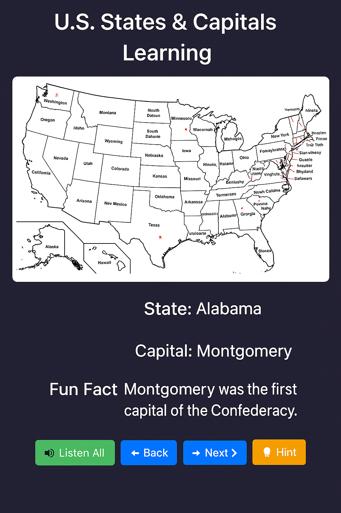

# 🇺🇸 U.S. States & Capitals Interactive Learning System | 美国地名互动学习系统

🎮 **Quick Access to Game | 快速启动游戏**  
[Start Interactive Game on GitHub Pages »](https://goeguo.github/GoeGuo/)

---

## 🎮 模式选择 | Mode Selection

- **Level 1 英文练习**  
  Learn U.S. states and capitals with English-only prompts  
  👉 `LearnMode_ImageMap_Complete50.html`

- **Level 1 中英文练习**  
  Bilingual version for easier understanding and memorization  
  👉 `LearnMode_ImageMap_Complete50_CN_Full_UPDATED.html`

- **Level 2 地理探索**  
  Enter a state name to discover its capital, location, and fun facts  
  👉 `StateCapital_GeoLinked_Final.html`

- **标签切换总入口**  
  Central interface with tab-switching to access all learning modes  
  👉 `US_States_2Level_Game_Complete50_Toggle.html`

---

## 🗂️ 文件说明 | File Descriptions

| 文件名 / File Name | 功能描述 / Description |
|-------------------|------------------------|
| `LearnMode_ImageMap_Complete50.html` | Level 1 英语学习界面 / English-only learning interface |
| `LearnMode_ImageMap_Complete50_CN_Full_UPDATED.html` | Level 1 中英双语界面 / Bilingual interface |
| `StateCapital_GeoLinked_Final.html` | Level 2 地理输入探索模式 / State name to info display mode |
| `US_States_2Level_Game_Complete50_Toggle.html` | 标签切换界面，整合全部功能 / Tab-switching UI with all modes |
| `us_map_with_capitals.jpeg` | 州与首府地图图像 / U.S. map with capitals |
| `README.md` | GitHub 项目说明文件 / Project introduction file |

---

## 📚 教学建议 | Educational Use

本工具设计用于帮助小学与初中学生学习美国地理和英语：
- 训练学生识记50个州与首府
- 提升英语拼写与地理文化理解能力
- 支持教师课堂教学与学生自主练习

This tool is ideal for elementary and middle school learners to:
- Memorize all 50 U.S. states and capitals
- Improve English spelling and cultural geography understanding
- Support both classroom instruction and independent practice

---

## 👩‍🏫 项目维护者 | Maintainer

该项目由教育者与技术专家共同开发，致力于为全球学习者提供免费、互动的地理学习体验。

Created by educators and technologists to make U.S. geography learning accessible, engaging, and interactive for all learners.
